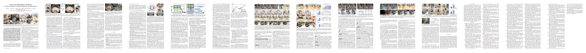
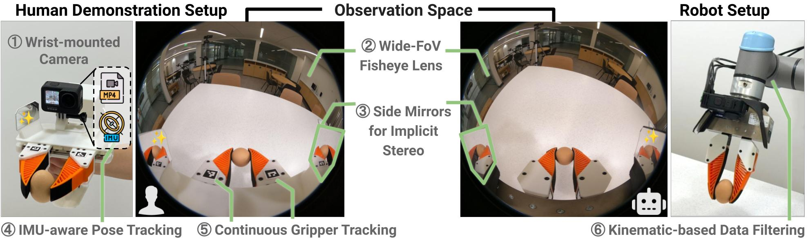

<h1 id="awesome-umi">Awesome-UMI</h1>

  <strong>A curated map of papers, datasets, policies, and taxonomy for the Universal Manipulation Interface ecosystem.</strong>

<!--  -->
<!--  -->

  <a href="#umi-core">Core</a> |
  <a href="#umi-method">Methods</a> |
  <a href="#umi-dataset">Datasets</a> |
  <a href="#umi-policy">Policies</a> |
  <a href="#umi-taxonomy">Taxonomy</a>

## About

**Awesome-UMI**: A curated list for the ecosystem around **Universal Manipulation Interface (UMI)**.

This repository focuses on:
- **UMI Core**: foundational papers, official resources, and direct ecosystem-defining follow-ups
- **UMI Method**: strong adjacent methods for robot-free teaching, teleoperation, dexterous manipulation, multimodal sensing, and cross-embodiment transfer
- **UMI Dataset**: official UMI datasets and UMI-native dataset families
- **UMI Policy**: policies trained on UMI-like data or commonly used as relevant baselines/support models
- **UMI Taxonomy**: embodiments, modalities, data formats, deployment-facing notes, and survey-style resources

This list is intentionally **UMI-first**, not a generic robot-manipulation survey.

  
   
  Source: original UMI project page, <a href="https://umi-gripper.github.io/">umi-gripper.github.io</a>.

  
   
  Source: original UMI project page, <a href="https://umi-gripper.github.io/">umi-gripper.github.io</a>.

## Must Read

Start here if you want the shortest path through the UMI ecosystem.

| Goal | Start with |
| :-- | :-- |
| Understand UMI | [UMI paper](https://arxiv.org/abs/2402.10329), [project](https://umi-gripper.github.io/), [code](https://github.com/real-stanford/universal_manipulation_interface) |
| Find UMI datasets | [UMI Data Community Site](https://umi-data.github.io/) |
| Build on UMI hardware/data collection | [Universal Manipulation Interface Codebase](https://github.com/real-stanford/universal_manipulation_interface), [UMI-FT](https://github.com/real-stanford/UMI-FT), [exUMI](https://silicx.github.io/exUMI/) |
| Explore dexterous UMI-style extensions | [DexUMI](https://arxiv.org/abs/2505.21864), [DexWild](https://dexwild.github.io/), [DexCap](https://arxiv.org/abs/2403.07788) |
| Train UMI-relevant policies | [Diffusion Policy](https://diffusion-policy.cs.columbia.edu/), [ACT / ALOHA](https://tonyzhaozh.github.io/aloha/), [OpenVLA](https://openvla.github.io/) |
| Compare modalities and formats | [UMI Taxonomy](#umi-taxonomy), [UMI Data Community Site](https://umi-data.github.io/) |

## News

- [2026-04-19] Rebuilt the repository into a single-file `README.md` structure for Awesome-UMI.
- [2026-04-19] Added `AGENTS.md` to define curation scope, metadata rules, and Conventional Commits.

## Contents

- [Awesome-UMI](#awesome-umi)
  - [About](#about)
  - [Must Read](#must-read)
  - [News](#news)
  - [UMI Core](#umi-core)
    - [Foundational Paper](#foundational-paper)
    - [Official Resources](#official-resources)
  - [UMI Method](#umi-method)
    - [Human Demonstration Interfaces](#human-demonstration-interfaces)
    - [Dexterous Hand / DexHand](#dexterous-hand--dexhand)
    - [Multimodal / Force / Tactile](#multimodal--force--tactile)
    - [In-the-Wild / Mobile / Whole-Body](#in-the-wild--mobile--whole-body)
  - [UMI Dataset](#umi-dataset)
    - [Official / Core Datasets](#official--core-datasets)
    - [UMI-native Dataset Families](#umi-native-dataset-families)
    - [Cross-Embodiment / Large-Scale Adjacent Datasets](#cross-embodiment--large-scale-adjacent-datasets)
    - [Dexterous / Hand-centric Datasets](#dexterous--hand-centric-datasets)
    - [Multimodal / Force-aware Datasets](#multimodal--force-aware-datasets)
    - [Mobile / Whole-Body Datasets](#mobile--whole-body-datasets)
  - [UMI Policy](#umi-policy)
    - [Imitation Learning](#imitation-learning)
    - [Diffusion / ACT-style Policies](#diffusion--act-style-policies)
    - [VLA](#vla)
  - [UMI Taxonomy](#umi-taxonomy)
    - [Embodiments](#embodiments)
    - [Observation Modalities](#observation-modalities)
    - [Action Spaces](#action-spaces)
    - [Data Formats / Storage](#data-formats--storage)
    - [Evaluation / Surveys / Notes](#evaluation--surveys--notes)
  - [Citation](#citation)
  - [Acknowledgement](#acknowledgement)

## UMI Core

Foundational UMI resources: the original paper, official project/code/data links, and direct ecosystem entry points.

### Foundational Paper

| Date | Keywords | Institute (first) | Paper | Publication | Others |
| :--: | :------: | :---------------: | :--- | :---------: | :----: |
| 2024-02-15 | UMI, Robot-Free Teaching, Bimanual, Zero-Shot | Stanford | [Universal Manipulation Interface: In-The-Wild Robot Teaching Without In-The-Wild Robots](https://arxiv.org/abs/2402.10329) | RSS 2024 | [project](https://umi-gripper.github.io/) / [github](https://github.com/real-stanford/universal_manipulation_interface) / [data](https://umi-data.github.io/) |

### Official Resources

| Date | Keywords | Institute (first) | Paper | Publication | Others |
| :--: | :------: | :---------------: | :--- | :---------: | :----: |
| 2024-02-15 | Official Dataset Index, Data Community | Stanford | [UMI Data Community Site](https://umi-data.github.io/) | Website | [page](https://umi-data.github.io/) |
| 2024-02-15 | Official Code, Training Stack | Stanford | [Universal Manipulation Interface Codebase](https://github.com/real-stanford/universal_manipulation_interface) | GitHub | [github](https://github.com/real-stanford/universal_manipulation_interface) |
| 2024-02-15 | Official Project Page | Stanford | [UMI Project Page](https://umi-gripper.github.io/) | Website | [project](https://umi-gripper.github.io/) |

## UMI Method

Methods for UMI-style robot-free teaching, teleoperation, cross-embodiment transfer, dexterous manipulation, and multimodal deployment.

### Human Demonstration Interfaces

| Date | Keywords | Institute (first) | Paper | Publication | Others |
| :--: | :------: | :---------------: | :--- | :---------: | :----: |
| 2025-10-02 | Active Perception, VR, Robot-Free | Shanghai University | [ActiveUMI: Robotic Manipulation with Active Perception from Robot-Free Human Demonstrations](https://arxiv.org/abs/2510.01607) | arXiv | [project](https://activeumi.github.io/) |
| 2025-09-18 | Tactile, Robot Teaching, Single-Arm | SJTU | [exUMI: Extensible Robot Teaching System with Action-aware Task-agnostic Tactile Representation](https://silicx.github.io/exUMI/) | CoRL 2025 | [project](https://silicx.github.io/exUMI/) / [github](https://github.com/silicx/exUMI) |
| 2024-10-31 | Egocentric, Imitation, Human-First | - | [EgoMimic: Scaling Imitation Learning via Egocentric Video](https://arxiv.org/abs/2410.24221) | arXiv | [project](https://egomimic.github.io/) / [github](https://github.com/SimarKareer/EgoMimic) |
| 2024-07-02 | Teleoperation, Immersive, Active Visual Feedback | - | [Open-TeleVision: Teleoperation with Immersive Active Visual Feedback](https://arxiv.org/abs/2407.01512) | CoRL 2024 | [github](https://github.com/OpenTeleVision/TeleVision) |
| 2024-03-12 | Teleoperation, VR, Bimanual | NYU | [OPEN TEACH: A Versatile Teleoperation System for Robotic Manipulation](https://arxiv.org/abs/2403.07870) | arXiv | [github](https://github.com/aadhithya14/Open-Teach) |
| 2024-02-15 | Handheld Interface, Bimanual, Portable | Stanford | [Universal Manipulation Interface: In-The-Wild Robot Teaching Without In-The-Wild Robots](https://arxiv.org/abs/2402.10329) | RSS 2024 | [project](https://umi-gripper.github.io/) / [github](https://github.com/real-stanford/universal_manipulation_interface) |

### Dexterous Hand / DexHand

| Date | Keywords | Institute (first) | Paper | Publication | Others |
| :--: | :------: | :---------------: | :--- | :---------: | :----: |
| 2025-05-28 | DexHand, Wearable, Cross-Hand | Stanford | [DexUMI: Using Human Hand as the Universal Manipulation Interface for Dexterous Manipulation](https://arxiv.org/abs/2505.21864) | RSSW 2025 | [data](https://umi-data.github.io/) |
| 2025-05-12 | DexHand, In-the-Wild, Human-to-Robot | CMU | [DexWild](https://dexwild.github.io/) | RSS 2025 | [project](https://dexwild.github.io/) |
| 2024-03-12 | DexHand, Mocap, Data Collection | Stanford | [DexCap: Scalable and Portable Mocap Data Collection System for Dexterous Manipulation](https://arxiv.org/abs/2403.07788) | arXiv | [github](https://github.com/j96w/DexCap) |

### Multimodal / Force / Tactile

| Date | Keywords | Institute (first) | Paper | Publication | Others |
| :--: | :------: | :---------------: | :--- | :---------: | :----: |
| 2026-01-15 | Force, Compliance, Contact-Rich | Stanford | [In-the-Wild Compliant Manipulation with UMI-FT](https://arxiv.org/abs/2601.09988) | ICRA 2026 | [github](https://github.com/real-stanford/UMI-FT) |
| 2025-11-08 | Vision+Tactile, Fine Manipulation | Tsinghua | [ViTaMIn-B](https://chuanyune.github.io/ViTaMIn-B_page/) | arXiv | [project](https://chuanyune.github.io/ViTaMIn-B_page/) |
| 2025-09-23 | Force-Guided, Wrist F/T, Contact-Rich | GIST | [ManipForce](https://sites.google.com/view/manipforce/) | ICRA 2026 | [project](https://sites.google.com/view/manipforce/) / [github](https://github.com/gist-ailab/ManipForce) |
| 2025-04-08 | Robot-Free, Visuo-Tactile, Contact-Rich | Tsinghua | [ViTaMIn: Learning Contact-Rich Tasks Through Robot-Free Visuo-Tactile Manipulation Interface](http://arxiv.org/abs/2504.06156) | arXiv | [project](https://chuanyune.github.io/ViTaMIn_page/) |

### In-the-Wild / Mobile / Whole-Body

| Date | Keywords | Institute (first) | Paper | Publication | Others |
| :--: | :------: | :---------------: | :--- | :---------: | :----: |
| 2026-02-06 | Humanoid, Whole-Body, Bimanual | Tsinghua | [HuMI](https://humanoid-manipulation-interface.github.io/) | arXiv / Dataset | [project](https://humanoid-manipulation-interface.github.io/) |
| 2025-10-02 | In-the-Wild, Active Perception, Bimanual | Shanghai University | [ActiveUMI: Robotic Manipulation with Active Perception from Robot-Free Human Demonstrations](https://arxiv.org/abs/2510.01607) | arXiv | [project](https://activeumi.github.io/) |
| 2024-07-14 | Mobile Manipulation, Whole-Body, Legged | Stanford | [UMI on Legs: Making Manipulation Policies Mobile with a Manipulation-Centric Whole-body Controller](https://arxiv.org/abs/2407.10353) | CoRL 2024 | [github](https://github.com/real-stanford/umi-on-legs) |
| 2024-06-27 | Audio-Visual, In-the-Wild, Real-World | Stanford | [ManiWAV: Learning Robot Manipulation from In-the-Wild Audio-Visual Data](https://arxiv.org/abs/2406.19464) | CoRL 2024 | [project](https://real.stanford.edu/maniwav) / [github](https://github.com/real-stanford/maniwav) |
| 2024-02-15 | In-the-Wild, Hardware-Agnostic, Long-Horizon | Stanford | [Universal Manipulation Interface: In-The-Wild Robot Teaching Without In-The-Wild Robots](https://arxiv.org/abs/2402.10329) | RSS 2024 | [project](https://umi-gripper.github.io/) |

## UMI Dataset

Dataset families for UMI-native collection and strong adjacent manipulation settings that help train or evaluate UMI-style systems.

### Official / Core Datasets

| Date | Keywords | Institute (first) | Paper | Publication | Others |
| :--: | :------: | :---------------: | :--- | :---------: | :----: |
| 2024-02-15 | UMI, Bimanual, Zarr, MP4 | Stanford | [UMI Dataset Family](https://umi-data.github.io/) | Dataset | [project](https://umi-gripper.github.io/) / [data](https://umi-data.github.io/) |

### UMI-native Dataset Families

| Date | Keywords | Institute (first) | Paper | Publication | Others |
| :--: | :------: | :---------------: | :--- | :---------: | :----: |
| 2026-02-06 | Humanoid, Bimanual, Whole-Body | Tsinghua | [HuMI](https://humanoid-manipulation-interface.github.io/) | Dataset | [project](https://humanoid-manipulation-interface.github.io/) |
| 2025-11-08 | Vision, Tactile, Parallel Gripper | Tsinghua | [ViTaMIn-B](https://chuanyune.github.io/ViTaMIn-B_page/) | Dataset | [project](https://chuanyune.github.io/ViTaMIn-B_page/) |
| 2025-10-09 | Large-Scale, Household, LeRobot | Shanghai AI Lab | [FastUMI-100K](https://github.com/MrKeee/FastUMI-100K) | Dataset | [github](https://github.com/MrKeee/FastUMI-100K) |
| 2025-09-23 | Multi-View, Segmentation, Placement | NYU Abu Dhabi | [MV-UMI](https://mv-umi.github.io) | Dataset | [project](https://mv-umi.github.io) |
| 2025-09-18 | exUMI, Single-Arm, Tactile | SJTU | [exUMI](https://silicx.github.io/exUMI/) | Dataset | [project](https://silicx.github.io/exUMI/) |
| 2025-07-20 | In-the-Wild, Tactile, Proprio | Columbia | [Touch in the Wild](https://binghao-huang.github.io/touch_in_the_wild/) | Dataset | [project](https://binghao-huang.github.io/touch_in_the_wild/) |
| 2025-05-28 | DexHand, Force/Torque, Inspire/XHand | Tsinghua | [DexUMI](https://umi-data.github.io/) | Dataset | [data](https://umi-data.github.io/) |
| 2025-05-12 | DexHand, In-the-Wild, Human-to-Robot | CMU | [DexWild](https://dexwild.github.io/) | Dataset | [project](https://dexwild.github.io/) |
| 2025-04-08 | Vision, Tactile, Precision Tasks | Tsinghua | [ViTaMIn](https://chuanyune.github.io/ViTaMIn_page/) | Dataset | [project](https://chuanyune.github.io/ViTaMIn_page/) |
| 2024-11-06 | Sim2Real, HDF5, Manipulation | UT Austin | [LEGATO](https://ut-hcrl.github.io/LEGATO/) | Dataset | [project](https://ut-hcrl.github.io/LEGATO/) |
| 2024-10-24 | Scaling Laws, Zarr, MP4 | Tsinghua | [Data Scaling Laws](https://data-scaling-laws.github.io/) | Dataset | [project](https://data-scaling-laws.github.io/) |
| 2024-09-29 | Household, HDF5, Fast Collection | Shanghai AI Lab | [Fast-UMI](https://fastumi.com/) | Dataset | [project](https://fastumi.com/) |
| 2024-06-27 | Audio, In-the-Wild, Manipulation | Stanford | [ManiWAV](https://mani-wav.github.io/) | Dataset | [project](https://mani-wav.github.io/) |

### Cross-Embodiment / Large-Scale Adjacent Datasets

| Date | Keywords | Institute (first) | Paper | Publication | Others |
| :--: | :------: | :---------------: | :--- | :---------: | :----: |
| 2024-03-19 | In-the-Wild, Large-Scale, Multi-Robot | Stanford | [DROID: A Large-Scale In-The-Wild Robot Manipulation Dataset](https://arxiv.org/abs/2403.12945) | arXiv | [project](https://droid-dataset.github.io/) |
| 2023-10-26 | Scalable Data Generation, Simulation, Demonstrations | NVIDIA | [MimicGen: A Data Generation System for Scalable Robot Learning using Human Demonstrations](https://arxiv.org/abs/2310.17596) | CoRL 2023 | [project](https://mimicgen.github.io/) / [github](https://github.com/NVlabs/mimicgen_environments) |
| 2023-10-13 | Cross-Embodiment, RT-X, Multi-Dataset | Stanford | [Open X-Embodiment: Robotic Learning Datasets and RT-X Models](https://arxiv.org/abs/2310.08864) | arXiv | [project](https://robotics-transformer-x.github.io/) / [github](https://github.com/google-deepmind/open_x_embodiment) |
| 2023-08-24 | Large-Scale, Real-Robot, Multi-Task | Berkeley | [BridgeData V2: A Dataset for Robot Learning at Scale](https://arxiv.org/abs/2308.12952) | CoRL 2023 | [project](https://rail-berkeley.github.io/bridgedata/) / [github](https://github.com/rail-berkeley/bridge_data_v2) |
| 2023-07-03 | One-Shot, Diverse Skills, Real-Robot | Tsinghua | [RH20T: A Comprehensive Robotic Dataset for Learning Diverse Skills in One-Shot](https://arxiv.org/abs/2307.00595) | ICRA 2024 | [project](https://rh20t.github.io/) / [github](https://github.com/rh20t/rh20t_api) |

### Dexterous / Hand-centric Datasets

| Date | Keywords | Institute (first) | Paper | Publication | Others |
| :--: | :------: | :---------------: | :--- | :---------: | :----: |
| 2025-05-28 | DexHand, Force/Torque, Inspire/XHand | Tsinghua | [DexUMI](https://umi-data.github.io/) | Dataset | [data](https://umi-data.github.io/) |
| 2025-05-12 | DexHand, Human/Robot, In-the-Wild | CMU | [DexWild](https://dexwild.github.io/) | Dataset | [project](https://dexwild.github.io/) |

### Multimodal / Force-aware Datasets

| Date | Keywords | Institute (first) | Paper | Publication | Others |
| :--: | :------: | :---------------: | :--- | :---------: | :----: |
| 2025-11-08 | Vision+Tactile, Wiping, Scooping | Tsinghua | [ViTaMIn-B](https://chuanyune.github.io/ViTaMIn-B_page/) | Dataset | [project](https://chuanyune.github.io/ViTaMIn-B_page/) |
| 2025-09-23 | Wrist F/T, HDF5, Assembly | GIST | [ManipForce](https://sites.google.com/view/manipforce/) | Dataset | [project](https://sites.google.com/view/manipforce/) |
| 2025-07-20 | Tactile, Proprio, In-the-Wild | Columbia | [Touch in the Wild](https://binghao-huang.github.io/touch_in_the_wild/) | Dataset | [project](https://binghao-huang.github.io/touch_in_the_wild/) |
| 2025-04-08 | Vision+Tactile, Fine Manipulation | Tsinghua | [ViTaMIn](https://chuanyune.github.io/ViTaMIn_page/) | Dataset | [project](https://chuanyune.github.io/ViTaMIn_page/) |
| 2024-06-27 | Audio, Real-World, Manipulation | Stanford | [ManiWAV](https://mani-wav.github.io/) | Dataset | [project](https://mani-wav.github.io/) |

### Mobile / Whole-Body Datasets

| Date | Keywords | Institute (first) | Paper | Publication | Others |
| :--: | :------: | :---------------: | :--- | :---------: | :----: |
| 2026-02-06 | Humanoid, Pelvis, Feet, Bimanual | Tsinghua | [HuMI](https://humanoid-manipulation-interface.github.io/) | Dataset | [project](https://humanoid-manipulation-interface.github.io/) |
| 2024-07-14 | Legged, Mobile, Zarr | Stanford | [UMI on Legs](https://umi-on-legs.github.io/) | Dataset | [project](https://umi-on-legs.github.io/) |

## UMI Policy

Policies and support models that are trained on UMI-like data, evaluated in adjacent settings, or commonly used as UMI-relevant baselines.

### Imitation Learning

| Date | Keywords | Institute (first) | Paper | Publication | Others |
| :--: | :------: | :---------------: | :--- | :---------: | :----: |
| 2024-10-31 | Egocentric, Imitation, Human Video | - | [EgoMimic: Scaling Imitation Learning via Egocentric Video](https://arxiv.org/abs/2410.24221) | arXiv | [project](https://egomimic.github.io/) / [github](https://github.com/SimarKareer/EgoMimic) |
| 2024-05-20 | Generalist Policy, Open-Source, Cross-Embodiment | Berkeley | [Octo: An Open-Source Generalist Robot Policy](https://arxiv.org/abs/2405.12213) | arXiv | [project](https://octo-models.github.io/) |
| 2024-02-15 | Relative Actions, Latency Matching, Imitation | Stanford | [Universal Manipulation Interface: In-The-Wild Robot Teaching Without In-The-Wild Robots](https://arxiv.org/abs/2402.10329) | RSS 2024 | [github](https://github.com/real-stanford/universal_manipulation_interface) |
| 2024-01-04 | Mobile ALOHA, Whole-Body, Bimanual | Stanford | [Mobile ALOHA: Learning Bimanual Mobile Manipulation with Low-Cost Whole-Body Teleoperation](https://arxiv.org/abs/2401.02117) | arXiv | [project](https://mobile-aloha.github.io) |
| 2023-10-13 | RT-X, Cross-Embodiment, Multi-Dataset | Stanford | [Open X-Embodiment: Robotic Learning Datasets and RT-X Models](https://arxiv.org/abs/2310.08864) | arXiv | [project](https://robotics-transformer-x.github.io/) / [github](https://github.com/google-deepmind/open_x_embodiment) |
| 2023-09-18 | One-Shot BC, Action Chunking | CMU | [One ACT Play: Single Demonstration Behavior Cloning with Action Chunking Transformers](https://arxiv.org/abs/2309.10175) | arXiv | [paper](https://arxiv.org/abs/2309.10175) |
| 2023-09-05 | Semantic Augmentation, Action Chunking, IL | - | [RoboAgent: Towards Sample Efficient Robot Manipulation with Semantic Augmentations and Action Chunking](https://arxiv.org/abs/2309.01918) | ICRA 2024 | [project](https://robot-tv.github.io/) / [github](https://github.com/robopen/roboagent/) |
| 2023-04-23 | ACT, Bimanual, Low-Cost Hardware | Stanford | [Learning Fine-Grained Bimanual Manipulation with Low-Cost Hardware](https://arxiv.org/abs/2304.13705) | arXiv | [project](https://tonyzhaozh.github.io/aloha/) |
| 2021-08-06 | Offline IL, Manipulation Benchmark, robomimic | Stanford | [What Matters in Learning from Offline Human Demonstrations for Robot Manipulation](https://arxiv.org/abs/2108.03298) | CoRL 2021 | [project](https://robomimic.github.io/) / [github](https://github.com/ARISE-Initiative/robomimic) |

### Diffusion / ACT-style Policies

| Date | Keywords | Institute (first) | Paper | Publication | Others |
| :--: | :------: | :---------------: | :--- | :---------: | :----: |
| 2023-04-23 | ACT, Bimanual, Behavior Cloning | Stanford | [Learning Fine-Grained Bimanual Manipulation with Low-Cost Hardware](https://arxiv.org/abs/2304.13705) | arXiv | [project](https://tonyzhaozh.github.io/aloha/) |
| 2023-03-07 | Diffusion Policy, Visuomotor, Receding Horizon | Columbia | [Diffusion Policy: Visuomotor Policy Learning via Action Diffusion](https://arxiv.org/abs/2303.04137) | RSS 2023 | [project](https://diffusion-policy.cs.columbia.edu/) |

### VLA

| Date | Keywords | Institute (first) | Paper | Publication | Others |
| :--: | :------: | :---------------: | :--- | :---------: | :----: |
| 2024-10-31 | pi0, VLA, Flow Matching | Physical Intelligence | [π0: A Vision-Language-Action Flow Model for General Robot Control](https://arxiv.org/abs/2410.24164) | RSS 2025 | [page](https://physicalintelligence.company/blog/pi0) |
| 2024-06-13 | OpenVLA, Open-Source, Transfer | Stanford | [OpenVLA: An Open-Source Vision-Language-Action Model](https://arxiv.org/abs/2406.09246) | arXiv | [project](https://openvla.github.io/) |
| 2023-07-28 | RT-2, VLA, Generalist Control | Google DeepMind | [RT-2: Vision-Language-Action Models Transfer Web Knowledge to Robotic Control](https://arxiv.org/abs/2307.15818) | arXiv | [project](https://robotics-transformer2.github.io/) |
| 2022-12-13 | RT-1, Robotics Transformer, Real-World Control | Google | [RT-1: Robotics Transformer for Real-World Control at Scale](https://arxiv.org/abs/2212.06817) | RSS 2023 | [project](https://robotics-transformer1.github.io/) |

## UMI Taxonomy

Structured references for embodiments, observation modalities, action spaces, storage formats, and evaluation dimensions in the UMI ecosystem.

### Embodiments

| Date | Keywords | Institute (first) | Paper | Publication | Others |
| :--: | :------: | :---------------: | :--- | :---------: | :----: |
| 2026-02-06 | Humanoid, Pelvis, Feet, Bimanual | Tsinghua | [HuMI](https://humanoid-manipulation-interface.github.io/) | Dataset | [project](https://humanoid-manipulation-interface.github.io/) |
| 2025-05-28 | Dexterous Hand, Inspire, XHand | Tsinghua | [DexUMI](https://umi-data.github.io/) | Dataset | [data](https://umi-data.github.io/) |
| 2024-07-14 | Legged, Mobile Manipulation | Stanford | [UMI on Legs](https://umi-on-legs.github.io/) | Dataset | [project](https://umi-on-legs.github.io/) |
| 2024-02-15 | Bimanual, Parallel Gripper | Stanford | [Universal Manipulation Interface: In-The-Wild Robot Teaching Without In-The-Wild Robots](https://arxiv.org/abs/2402.10329) | RSS 2024 | [project](https://umi-gripper.github.io/) |

### Observation Modalities

| Date | Keywords | Institute (first) | Paper | Publication | Others |
| :--: | :------: | :---------------: | :--- | :---------: | :----: |
| 2025-11-08 | Image, Tactile | Tsinghua | [ViTaMIn-B](https://chuanyune.github.io/ViTaMIn-B_page/) | Dataset | [project](https://chuanyune.github.io/ViTaMIn-B_page/) |
| 2025-09-23 | Image x2, Wrist F/T | GIST | [ManipForce](https://sites.google.com/view/manipforce/) | Dataset | [project](https://sites.google.com/view/manipforce/) |
| 2025-07-20 | Image, Tactile, Proprio | Columbia | [Touch in the Wild](https://binghao-huang.github.io/touch_in_the_wild/) | Dataset | [project](https://binghao-huang.github.io/touch_in_the_wild/) |
| 2024-06-27 | Image, Audio, Proprio | Stanford | [ManiWAV](https://mani-wav.github.io/) | Dataset | [project](https://mani-wav.github.io/) |
| 2024-02-15 | Image, Proprio, Bimanual | Stanford | [Universal Manipulation Interface: In-The-Wild Robot Teaching Without In-The-Wild Robots](https://arxiv.org/abs/2402.10329) | RSS 2024 | [project](https://umi-gripper.github.io/) |

### Action Spaces

| Date | Keywords | Institute (first) | Paper | Publication | Others |
| :--: | :------: | :---------------: | :--- | :---------: | :----: |
| 2025-09-23 | 6-DoF EE, Parallel Gripper | GIST | [ManipForce](https://sites.google.com/view/manipforce/) | Dataset | [project](https://sites.google.com/view/manipforce/) |
| 2025-05-28 | DexHand, Human-Hand Interface | Tsinghua | [DexUMI](https://umi-data.github.io/) | Dataset | [data](https://umi-data.github.io/) |
| 2024-02-15 | Relative Trajectory, 6-DoF, Hardware-Agnostic | Stanford | [Universal Manipulation Interface: In-The-Wild Robot Teaching Without In-The-Wild Robots](https://arxiv.org/abs/2402.10329) | RSS 2024 | [project](https://umi-gripper.github.io/) |

### Data Formats / Storage

| Date | Keywords | Institute (first) | Paper | Publication | Others |
| :--: | :------: | :---------------: | :--- | :---------: | :----: |
| 2025-10-09 | LeRobot, Large-Scale Household | Shanghai AI Lab | [FastUMI-100K](https://github.com/MrKeee/FastUMI-100K) | Dataset | [github](https://github.com/MrKeee/FastUMI-100K) |
| 2025-09-23 | HDF5, Force/Torque | GIST | [ManipForce](https://sites.google.com/view/manipforce/) | Dataset | [project](https://sites.google.com/view/manipforce/) |
| 2024-11-06 | HDF5, Sim2Real | UT Austin | [LEGATO](https://ut-hcrl.github.io/LEGATO/) | Dataset | [project](https://ut-hcrl.github.io/LEGATO/) |
| 2024-10-24 | Zarr, MP4, Scaling | Tsinghua | [Data Scaling Laws](https://data-scaling-laws.github.io/) | Dataset | [project](https://data-scaling-laws.github.io/) |
| 2024-02-15 | Zarr, MP4, Replay Buffer | Stanford | [Universal Manipulation Interface: In-The-Wild Robot Teaching Without In-The-Wild Robots](https://arxiv.org/abs/2402.10329) | RSS 2024 | [data](https://umi-data.github.io/) |

### Evaluation / Surveys / Notes

| Date | Keywords | Institute (first) | Paper | Publication | Others |
| :--: | :------: | :---------------: | :--- | :---------: | :----: |
| 2024-10-24 | Scaling Laws, Multi-Env, Data Efficiency | Tsinghua | [Data Scaling Laws](https://data-scaling-laws.github.io/) | Dataset / Study | [project](https://data-scaling-laws.github.io/) |
| 2024-02-15 | Zero-Shot, Cross-Platform, Long-Horizon | Stanford | [Universal Manipulation Interface: In-The-Wild Robot Teaching Without In-The-Wild Robots](https://arxiv.org/abs/2402.10329) | RSS 2024 | [project](https://umi-gripper.github.io/) |
| 2024-02-15 | Community Taxonomy, Family Index | Stanford | [UMI Data Community Site](https://umi-data.github.io/) | Website | [page](https://umi-data.github.io/) |

## Citation

Contributions are welcome.

Before adding a new entry:
- check `AGENTS.md`
- keep the six-column metadata format
- sort by **Date descending** within the subsection
- prefer canonical paper/project/dataset links
- keep the repository **UMI-first**

For commit messages, use **Conventional Commits**, for example:
- `docs(readme): add fastumi-100k to umi dataset`
- `fix(readme): correct dexumi publication metadata`
- `refactor(readme): reorganize umi policy subsections`

## Acknowledgement

The README structure is inspired by the clean single-file awesome-list style used in `ActiveVisionLab/Awesome-LLM-3D`.
